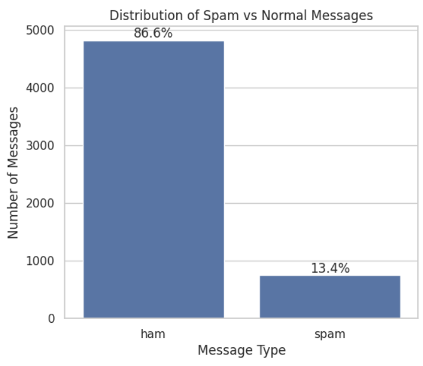
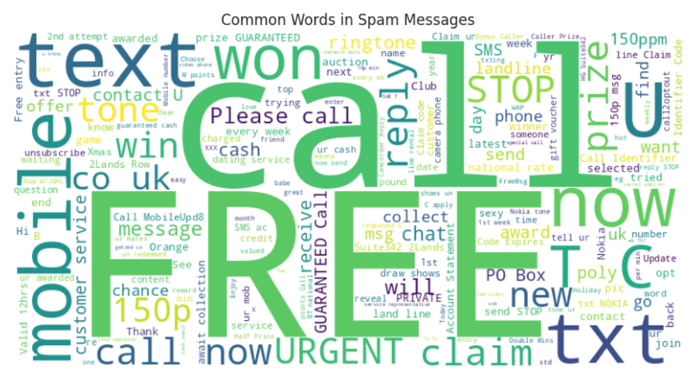
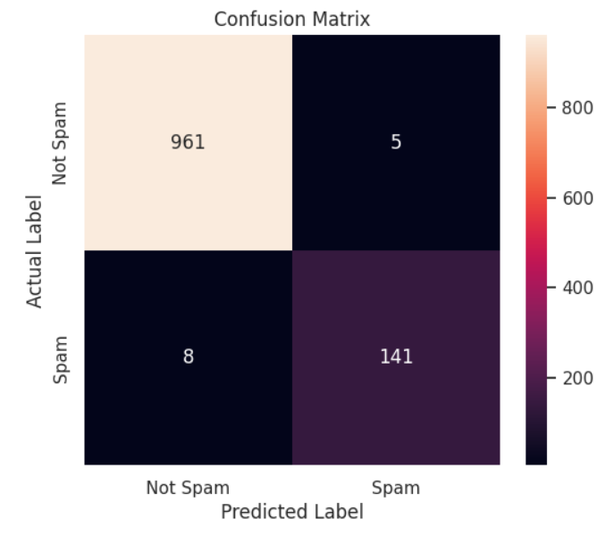
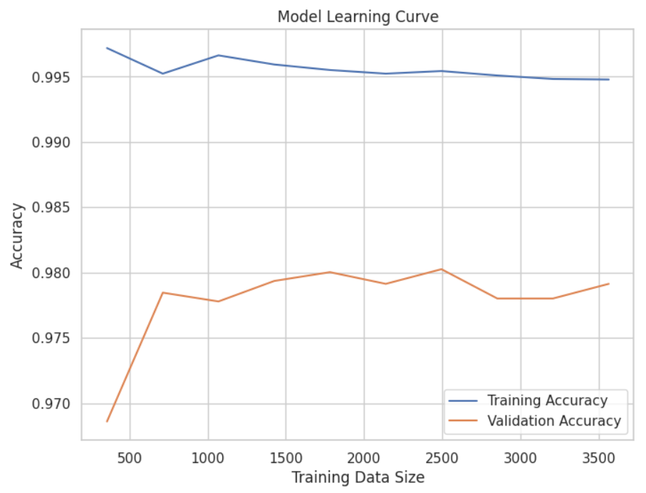

# Spam Message AI Classifier


---

# Features

* Spam vs Ham text classification
* NLP text vectorization using CountVectorizer
* Multinomial Naive Bayes machine learning model
* Data visualizations using Matplotlib and Seaborn
* Word cloud generation for spam messages
* Confusion matrix heatmap
* Learning curve visualization
* Interactive terminal message predictor
* Accuracy evaluation and testing pipeline

---

# Tech Stack

* Python
* Pandas
* NumPy
* Scikit-learn
* Matplotlib
* Seaborn
* WordCloud
* Jupyter Notebook

---

# Repository Structure

```txt
spam-message-ai-classifier/
│
├── Spam_Message_AI_Model.ipynb
├── images/
│   ├── dataset_distribution.png
│   ├── spam_wordcloud.png
│   ├── confusion_matrix.png
│   └── learning_curve.png
├── README.md
└── requirements.txt
```

---

# Dataset

This project uses the SMS Spam Collection Dataset:

* Ham = Normal message
* Spam = Unwanted or promotional message

Dataset source:

```txt
https://raw.githubusercontent.com/justmarkham/pycon-2016-tutorial/master/data/sms.tsv
```

---

# Project Workflow

1. Load and clean dataset
2. Convert labels into numerical format
3. Split data into training and testing sets
4. Transform text into vectors using NLP
5. Train Multinomial Naive Bayes model
6. Evaluate accuracy and confusion matrix
7. Visualize results and important spam words
8. Predict custom user messages

---

# Example Predictions

```txt
Input: Congratulations! You won a free iPhone!
Prediction: Spam
```

```txt
Input: Hey, are we still meeting after school?
Prediction: Not Spam
```

---

# Installation

Clone the repository:

```bash
git clone https://github.com/DagaVedant/Spam-Message-AI-Classifier.git
cd spam-message-ai-classifier
```

Install dependencies:

```bash
pip install pandas numpy matplotlib seaborn scikit-learn wordcloud
```

Run the notebook:

```bash
jupyter notebook
```

---

# Screenshots / Images

## Dataset Distribution Graph



---

## Spam Word Cloud



---

## Confusion Matrix



---

## Learning Curve



---

# Model Performance

The model is evaluated using:

* Accuracy Score
* Confusion Matrix
* Cross Validation Learning Curves

The classifier performs well for beginner-level NLP spam detection and demonstrates how machine learning can process and classify text data efficiently.

---

# Future Improvements

* Add TF-IDF vectorization
* Use deep learning models like LSTMs or Transformers
* Deploy as a web app using Flask or Streamlit
* Add real-time SMS filtering
* Improve preprocessing and feature engineering

---

# License

This project is open-source and available under the MIT License.

---

# Author

Developed as a machine learning and NLP project focused on spam message detection and text classification for my CS Club

Developed as a machine learning and NLP project focused on spam message detection and text classification.
